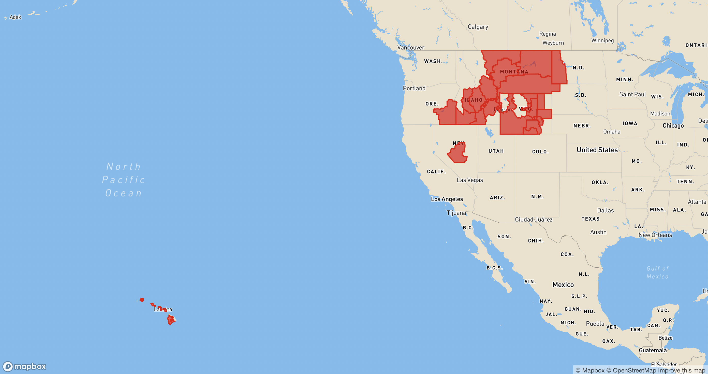

# mbx-earthquakes
This is a basic mapbox map hosted at [caseymm.github.io/mbx-earthquakes](caseymm.github.io/mbx-earthquakes). The map is set up to display geojson passed to it through the url search parameters.

### URL Search Parameters
- `url` (geojson must be hosted somewhere, you cannot pass in raw geojson, e.g. https://weather-warnings.s3.us-west-1.amazonaws.com/rfw/latest.json)

locally:
`http://localhost:3000/mbx-earthquakes?url=https://caseymm-earthquakes.s3-us-west-1.amazonaws.com/shakemaps/us7000fes8.geojson`

e.g. 
https://caseymm.github.io/mbx-devour/?url=https://weather-warnings.s3.us-west-1.amazonaws.com/rfw/latest.json&fill=e60000&fill-opacity=.6

<!-- That example would render this on the map:
 -->

### Locally
- build: `npm run build`
- add, commit, push
- deploy: `npm run deploy`

